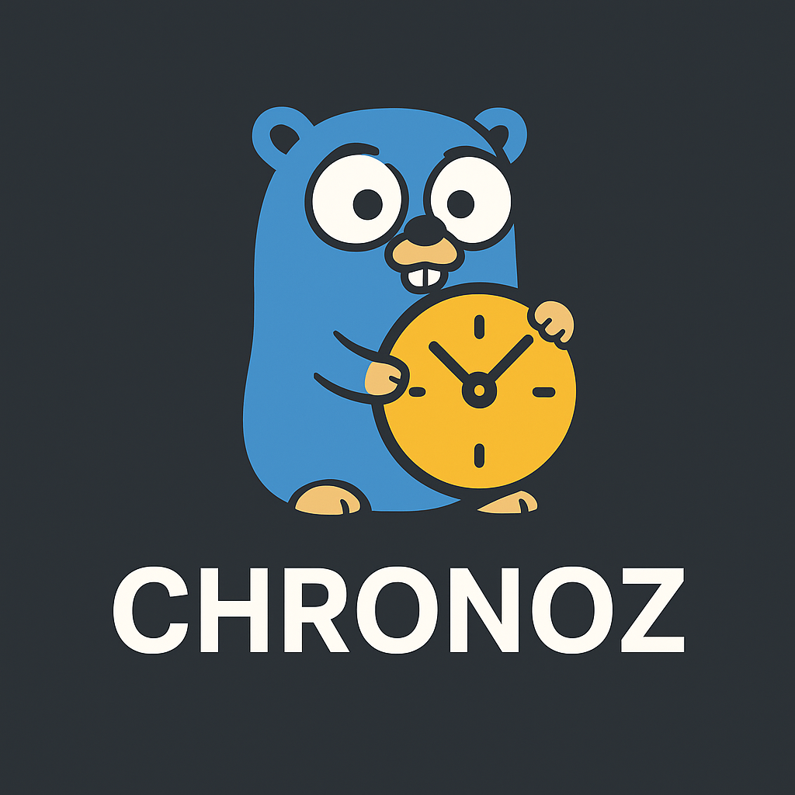

# Chronz — Context-Aware Timezone Utilities for Go

<p align="center">
  
</p>
<p align="center">
  <a href="https://pkg.go.dev/github.com/mhshajib/chronz"></a>
  <a href="https://goreportcard.com/report/github.com/mhshajib/chronz"></a>
  <a href="https://opensource.org/licenses/MIT"></a>
</p>

Chronz is a Go library that ensures all your timestamps are stored in UTC while automatically converting to and from local timezones. It uses a context.Context to determine which timezone should apply — either from an explicit timezone string (e.g., "Asia/Dhaka") or from a country_id mapped to a timezone.

It works with both:

- GORM (Postgres) via a TZTimeSerializer
- MongoDB via a TZCollection wrapper

## Overview

- Converts local <-> UTC automatically
- Context-driven per-request timezone (WithTZName, WithCountryID)
- Works with both Postgres (GORM) and MongoDB
- Optional custom country_id → timezone mapping
- Non-intrusive: no need to change schema or server TZ
- Includes runnable Docker Compose examples

## Installation

```bash
go get github.com/mhshajib/chronz
```

## Basic Usage

### Set a timezone

```go
ctx := chronz.WithTZName(context.Background(), "Asia/Dhaka")
```

### (Optional) Country ID mapping

```go
chronz.RegisterCountryTZMap(map[int]string{
    1: "Asia/Dhaka",
    2: "Asia/Kuala_Lumpur",
    3: "Europe/London",
})
ctx := chronz.WithCountryID(context.Background(), 1)
```

### Fallback and Default Timezone

If no timezone or country is provided, Chronz falls back to UTC by default.

You can change the default fallback for your entire application using:

````go
chronz.SetDefaultTZ("Asia/Dhaka")
```

After setting this, any context without WithTZName or WithCountryID will use "Asia/Dhaka" as its default timezone.

Example:

```go
func init() {
    chronz.SetDefaultTZ("Asia/Dhaka")
}
```

Now if you call:

```go
ctx := context.Background()
loc := chronz.LocationFromCtx(ctx)
fmt.Println(loc) // Asia/Dhaka

```

it will use your custom fallback timezone automatically.

## Using with GORM (Postgres)

### Import and register the serializer

```go
import (
  "gorm.io/gorm/schema"
  chronzgorm "github.com/mhshajib/chronz/chronz_gorm"
)

schema.RegisterSerializer("tztime", chronzgorm.TZTimeSerializer{})
````

### Tag your model fields

```go
type Order struct {
  ID        uint
  CreatedAt time.Time `tz:"local" gorm:"serializer:tztime"`
}
```

### Insert data (local → UTC)

```go
ctx := chronz.WithTZName(context.Background(), "Asia/Dhaka")
db.WithContext(ctx).Create(&Order{CreatedAt: time.Now()})
```

### Query data (UTC → local)

```go
var orders []Order
db.WithContext(ctx).Find(&orders)
fmt.Println(orders[0].CreatedAt) // in local timezone
```

### Use ArgTime for raw WHERE queries

```go
db.Where("created_at >= @created_at", chronzgorm.ArgTime(ctx, "created_at", input))
```

## Using with MongoDB

### Import and wrap collection

```go
import (
  chronzmongo "github.com/mhshajib/chronz/chronz_mongo"
  "go.mongodb.org/mongo-driver/mongo"
  "go.mongodb.org/mongo-driver/mongo/options"
)

client, _ := mongo.Connect(ctx, options.Client().ApplyURI("mongodb://localhost:27017"))
coll := chronzmongo.WrapCollection(client.Database("orders_db").Collection("orders"))
```

### Tag struct fields

```go
type Order struct {
  ID        string    `bson:"_id,omitempty"`
  CreatedAt time.Time `bson:"created_at" tz:"local"`
}
```

### Insert (local → UTC)

```go
ctx := chronz.WithTZName(context.Background(), "Asia/Dhaka")
coll.InsertOne(ctx, Order{CreatedAt: time.Now()})
```

### FindOne (UTC → local)

```go
res := coll.FindOne(ctx, bson.M{})
var out Order
chronzmongo.DecodeLocal(ctx, res, &out)
fmt.Println(out.CreatedAt)
```

### Aggregate (normalize pipelines)

```go
pipe := mongo.Pipeline{
  {{"$match", bson.M{"created_at": bson.M{"$gte": inputTime}}}},
}
pipe = chronzmongo.NormalizePipeline(ctx, pipe)
cur, _ := coll.Aggregate(ctx, pipe)
```

## Example Projects

### GORM + Postgres Example

Folder: examples/gorm_postgres

```bash
cd examples/gorm_postgres
docker compose up -d
go mod tidy
go run .
```

Expected output:

```
Orders (localized):
 -> 2025-11-02 21:47:00 +0600 +06
```

### MongoDB Example

Folder: examples/mongo

```bash
cd examples/mongo
docker compose up -d
go mod tidy
go run .
```

Expected output:

```
Inserted & read (localized): 2025-11-02 21:48:00 +0600 +06
```

## Directory Structure

```
chronz/
├── chronz/                # core ctx/parse/convert logic
│   ├── ctx.go
│   ├── parse.go
│   └── convert.go
│
├── chronz_gorm/           # GORM support
│   ├── serializer.go
│   └── args.go
│
├── chronz_mongo/          # Mongo support
│   ├── wrap.go
│   └── pipeline.go
│
├── examples/
│   ├── gorm_postgres/
│   │   ├── docker-compose.yml
│   │   ├── go.mod
│   │   └── main.go
│   └── mongo/
│       ├── docker-compose.yml
│       ├── go.mod
│       └── main.go
│
├── logo.png
└── README.md
```

## Design Philosophy

- UTC is the source of truth
- Local presentation is contextual
- Non-intrusive and framework-agnostic
- Designed for microservices with multi-country support

## License

MIT © 2025 [Shajib Sikder](https://github.com/mhshajib)

## Contributors

[](https://github.com/mhshajib/chronz/graphs/contributors)
