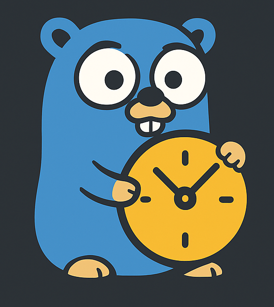

# Chronz — Context-Aware Timezone Utilities for Go

<p align="center">
  
</p>
<p align="center">
  <a href="https://pkg.go.dev/github.com/mhshajib/chronz"></a>
  <a href="https://goreportcard.com/report/github.com/mhshajib/chronz"></a>
  <a href="LICENSE"></a>
</p>

Chronz is a lightweight Go library that keeps your timestamps consistent across databases and APIs.
It automatically stores all times in UTC while transparently converting to and from each user’s local timezone — driven by context.Context.
The timezone is determined either by an explicit name (e.g., "Asia/Dhaka") or a country_id mapped to a region.

It integrates seamlessly with:

- GORM (Postgres) via a TZTimeSerializer
- MongoDB via a TZCollection wrapper or hook-based interceptor
- gRPC via context-aware interceptors

---

## Installation

```bash
go get github.com/mhshajib/chronz
```

### Optionally, if you want to use just one adapter:

```bash
# For Postgres (GORM)
go get github.com/mhshajib/chronz/chronz_gorm

# For MongoDB
go get github.com/mhshajib/chronz/chronz_mongo
```

## Quick Setup

### Postgres + GORM

```go
package boot

import (
    "github.com/mhshajib/chronz"
    chronzgorm "github.com/mhshajib/chronz/chronz_gorm"
    "gorm.io/gorm/schema"
)

func InitGormTZ() {
    chronz.SetDefaultTZ("Asia/Dhaka")
    schema.RegisterSerializer("tztime", chronzgorm.TZTimeSerializer{})
}
```

### MongoDB

#### Option A — Enable Global Hooks (no query changes)

```go
package boot

import (
    "github.com/mhshajib/chronz"
    chronzmongo "github.com/mhshajib/chronz/chronz_mongo"
    "go.mongodb.org/mongo-driver/mongo"
)

func InitMongoTZ(client *mongo.Client) {
    chronz.SetDefaultTZ("Asia/Dhaka")
    chronzmongo.EnableHooks(client)
}
```

#### Option B — Wrap Collection (explicit usage)

```go
coll := chronzmongo.WrapCollection(client.Database("orders").Collection("orders"))
```

---

## Example Usage

### MongoDB Example

```go
coll := client.Database("orders").Collection("orders")
ctx := chronz.WithTZName(context.Background(), "Asia/Dhaka")

coll.InsertOne(ctx, Order{CreatedAt: time.Now()}) // local → UTC
res := coll.FindOne(ctx, bson.M{})
var out Order
_ = res.Decode(&out)                              // UTC → local
fmt.Println(out.CreatedAt)
```

### GORM Example

```go
schema.RegisterSerializer("tztime", chronzgorm.TZTimeSerializer{})

ctx := chronz.WithTZName(context.Background(), "Asia/Dhaka")
db.WithContext(ctx).Create(&Order{CreatedAt: time.Now()}) // local → UTC

var out []Order
db.WithContext(ctx).Find(&out)                            // UTC → local

db.WithContext(ctx).
  Where("created_at >= @created_at", chronzgorm.ArgTime(ctx, "created_at", input)).
  Find(&out)
```

---

## Middleware Example (shared for both HTTP & gRPC)

### HTTP Middleware

```go
func WithTimezone(next http.Handler) http.Handler {
    return http.HandlerFunc(func(w http.ResponseWriter, r *http.Request) {
        ctx := r.Context()
        if tz := r.Header.Get("X-TZ"); tz != "" {
            ctx = chronz.WithTZName(ctx, tz)
        } else if cid := r.Header.Get("X-Country-ID"); cid != "" {
            if n, err := strconv.Atoi(cid); err == nil {
                ctx = chronz.WithCountryID(ctx, n)
            }
        }
        next.ServeHTTP(w, r.WithContext(ctx))
    })
}
```

### gRPC Interceptors

#### Unary Server Interceptor

```go
func TZUnaryServerInterceptor() grpc.UnaryServerInterceptor {
    return func(ctx context.Context, req interface{}, info *grpc.UnaryServerInfo, handler grpc.UnaryHandler) (interface{}, error) {
        if md, ok := metadata.FromIncomingContext(ctx); ok {
            if vals := md.Get("x-tz"); len(vals) > 0 && vals[0] != "" {
                ctx = chronz.WithTZName(ctx, vals[0])
            } else if vals := md.Get("x-country-id"); len(vals) > 0 && vals[0] != "" {
                if n, err := strconv.Atoi(vals[0]); err == nil {
                    ctx = chronz.WithCountryID(ctx, n)
                }
            }
        }
        return handler(ctx, req)
    }
}
```

#### Stream Server Interceptor

```go
type tzWrappedServerStream struct {
    grpc.ServerStream
    ctx context.Context
}
func (w *tzWrappedServerStream) Context() context.Context { return w.ctx }

func TZStreamServerInterceptor() grpc.StreamServerInterceptor {
    return func(srv interface{}, ss grpc.ServerStream, info *grpc.StreamServerInfo, handler grpc.StreamHandler) error {
        ctx := ss.Context()
        if md, ok := metadata.FromIncomingContext(ctx); ok {
            if vals := md.Get("x-tz"); len(vals) > 0 && vals[0] != "" {
                ctx = chronz.WithTZName(ctx, vals[0])
            } else if vals := md.Get("x-country-id"); len(vals) > 0 && vals[0] != "" {
                if n, err := strconv.Atoi(vals[0]); err == nil {
                    ctx = chronz.WithCountryID(ctx, n)
                }
            }
        }
        wrapped := &tzWrappedServerStream{ServerStream: ss, ctx: ctx}
        return handler(srv, wrapped)
    }
}
```

#### Client Interceptors (propagate context → metadata)

```go
func TZUnaryClientInterceptor() grpc.UnaryClientInterceptor {
    return func(ctx context.Context, method string, req, reply interface{}, cc *grpc.ClientConn, invoker grpc.UnaryInvoker, opts ...grpc.CallOption) error {
        if tz := chronz.TZNameFromCtx(ctx); tz != "" {
            ctx = metadata.AppendToOutgoingContext(ctx, "x-tz", tz)
        } else if cid, ok := chronz.CountryIDFromCtx(ctx); ok {
            ctx = metadata.AppendToOutgoingContext(ctx, "x-country-id", strconv.Itoa(cid))
        }
        return invoker(ctx, method, req, reply, cc, opts...)
    }
}
```

---

## API Reference

### Core Package (`chronz`)

#### `ToLocal(t time.Time, ctx context.Context) time.Time`

Converts a time to the local timezone specified in the context.

```go
ctx := chronz.WithTZName(context.Background(), "America/New_York")
utcTime := time.Now().UTC()
localTime := chronz.ToLocal(utcTime, ctx)
fmt.Println(localTime) // Displays time in America/New_York timezone
```

**Parameters:**

- `t`: The time to convert
- `ctx`: Context containing timezone information

**Returns:** Time converted to the local timezone from context

---

### GORM Package (`chronz_gorm`)

#### `ArgTimeValueFormat(ctx context.Context, v any, layout string) any`

Returns a formatted time string in the specified layout, converting local time to UTC. Useful for formatting timestamps in database queries.

```go
ctx := chronz.WithTZName(context.Background(), "Asia/Dhaka")
input := "2025-11-08 15:30:00"
formatted := chronzgorm.ArgTimeValueFormat(ctx, input, "2006-01-02")
// Returns: "2025-11-08" in UTC

db.Where("DATE(created_at) = ?", chronzgorm.ArgTimeValueFormat(ctx, input, "2006-01-02")).Find(&orders)
```

**Parameters:**

- `ctx`: Context containing timezone information
- `v`: Input value (can be a string parseable as time or `time.Time`)
- `layout`: Go time format layout string (e.g., `"2006-01-02"`, `"2006-01-02 15:04:05"`)

**Returns:** Formatted UTC time string, or original value if not parseable as time

---

## Example Projects

### GORM + Postgres Example

```bash
cd examples/gorm_postgres
docker compose up -d
go mod tidy
go run .
```

Expected output:

```
Orders (localized):
 -> 2025-11-02 21:47:00 +0600 +06
```

### MongoDB Example

```bash
cd examples/mongo
docker compose up -d
go mod tidy
go run .
```

Expected output:

```
Inserted & read (localized): 2025-11-02 21:48:00 +0600 +06
```

---

## License

Chronz License (MIT + Attribution) © 2025 [Sajib Sikder](https://github.com/mhshajib)

This software may be freely used, modified, and distributed with proper
attribution to the original author and repository.

## Contributors

<a href="https://github.com/mhshajib/chronz/graphs/contributors">
  
</a>

[](https://github.com/mhshajib/chronz/graphs/contributors)
